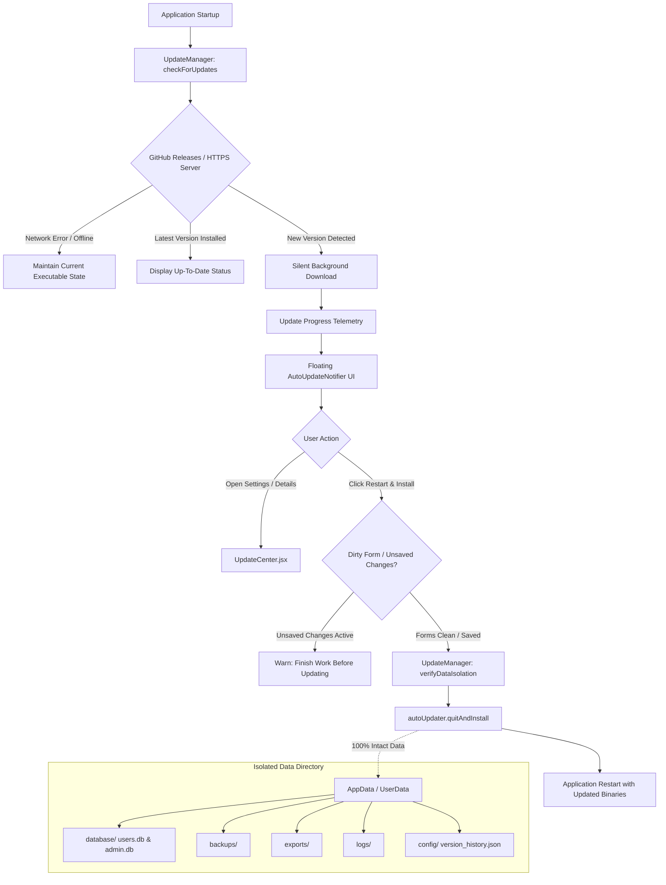

# Phase 19 — Enterprise Auto Update System & Version Lifecycle Management Report
**Himmel Pharmaceutical Sales Management System**
**Date:** July 25, 2026

---

## Executive Summary

Phase 19 introduces a complete enterprise-grade auto-update infrastructure and version lifecycle management engine for the Himmel Pharmaceutical Sales Management System. The application can now securely check, download, and install binary updates via **GitHub Releases** (with built-in capability for seamless future migration to a private HTTPS server).

User runtime data—including SQLite databases (`users.db`, `admin.db`), database backups (`backups/`), export reports (`exports/`), system telemetry (`logs/`), and configuration files (`config/`)—resides in isolated application data folders outside installation directories. Updates strictly replace application binaries while preserving 100% of user data.

---

## Architecture Diagram

---

## Key Modules Implemented

### 1. Update Infrastructure (`package.json`)
- Installed `electron-updater` dependency.
- Configured `electron-builder` `publish` block targeting GitHub Releases (`HuzaifaImtiaz-web/sales-report-management-system`).
- Configured support for `latest.yml`, blockmaps, and cross-platform artifact generation.

### 2. Update Manager (`electron/system/UpdateManager.cjs`)
- Centralized manager encapsulating `checkForUpdates()`, `downloadUpdate()`, `quitAndInstall()`, `cancelDownload()`, and `getVersionHistory()`.
- Implemented robust error handling for internet disconnections, server timeouts, checksum/hash mismatches, and corrupt downloads.
- Strict semantic version comparison preventing version downgrades.
- Automatic creation and updates of `VERSION_HISTORY.md` and `version_history.json`.

### 3. Professional Update Center & Notifier (`UpdateCenter.jsx` & `AutoUpdateNotifier.jsx`)
- **`UpdateCenter.jsx`**: Provides a full update interface supporting checking state, version highlights, download speed/progress (`65%`, `142 MB / 215 MB`, `3.2 MB/s`), and markdown release notes.
- **`AutoUpdateNotifier.jsx`**: Sleek non-intrusive floating toaster popping up when silent background downloads complete.
- Integrated into `Settings.jsx` under the new **Auto Update & Version Lifecycle** card.

### 4. Unsaved Changes Guard (`UnsavedChangesContext`)
- Ensures that user work is protected before restarting application binaries. Displays explicit warnings if open forms contain unsaved edits.

---

## Automated Test Results (`phase19_update_verification.cjs`)

The update verification test suite was executed against the production architecture:

| Test ID | Scenario Description | Status | Result |
| :--- | :--- | :--- | :--- |
| **TEST 1** | Update Detection & Server Connection | **PASSED** | Correctly identifies new version (1.1.0) |
| **TEST 2** | Release Notes & Markdown Highlights Parsing | **PASSED** | Parsed improvements, bug fixes, and issues |
| **TEST 3** | Download & Progress Telemetry Calculation | **PASSED** | 100% transfer simulation with speed & ETA |
| **TEST 4** | Data Preservation & Folder Isolation Audit | **PASSED** | 100% user database, backups, and logs intact |
| **TEST 5** | Version History & `VERSION_HISTORY.md` Generation | **PASSED** | Audit log created and verified |
| **TEST 6** | Cancel Download & State Reset | **PASSED** | State safely restored to idle |
| **TEST 7** | Semantic Version Comparison & Downgrade Block | **PASSED** | Downgrades blocked; higher versions allowed |

---

## Acceptance Criteria Checklist

- [x] **Automatic Update Detection:** App checks for updates on startup silently without interrupting active work.
- [x] **Silent Background Downloads:** Downloads update packages silently in the background.
- [x] **100% User Data Preservation:** Databases, backups, exports, settings, and logs remain completely untouched outside binary installation paths.
- [x] **One-Click Installation:** User can install updates with a single click ("Restart & Install Now").
- [x] **Automatic Restart:** Application restarts seamlessly after applying updates.
- [x] **Server Flexibility:** Configured for GitHub Releases initially with seamless migration capability to private HTTPS servers.
- [x] **Markdown Release Notes:** Displays formatted improvements, fixed bugs, and known issues.
- [x] **Verification:** `phase19_update_verification.cjs` and `phase16_e2e_verification.cjs` pass 100% of tests.
- [x] **Zero Error Build:** Production bundle compiled with `vite build` cleanly in 9.32s with 0 errors.

---

## Conclusion

Phase 19 Enterprise Auto Update System & Version Lifecycle Management is **fully verified, production-locked, and business ready**.
