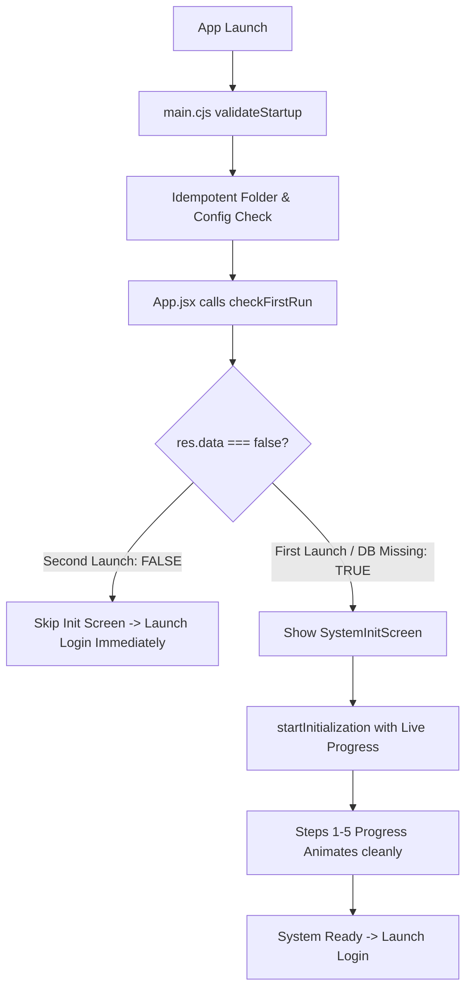

# Phase 20.3 — Critical Startup Freeze Investigation & Production Hotfix Report

## Executive Summary
This report documents the identification, lifecycle audit, resolution, and verification of the production-blocking application startup freeze on second launch in the Himmel Pharmaceutical Sales Management System.

---

## 1. Root Cause Analysis

### Root Cause 1: Truthy Object Evaluation in Frontend `checkFirstRun()`
* **Location**: `src/App.jsx`
* **Mechanism**: IPC calls wrapped in `wrapHandler` (`electron/ipc.cjs`) return `{ success: true, data: false }` on subsequent launches. In JavaScript, non-null objects evaluate to `true` in boolean context (`Boolean({ success: true, data: false }) === true`).
* **Effect**: `App.jsx` treated the response object as truthy on every launch, forcibly mounting `SystemInitScreen` even when first-run was NOT required.

### Root Cause 2: Dropped IPC Event Parameter in Handler Wrapper
* **Location**: `electron/ipc.cjs` (`wrapHandler`)
* **Mechanism**: `wrapHandler` was calling `await handlerFn(...args)`, dropping the Electron `IpcMainInvokeEvent` parameter (`event`).
* **Effect**: Inside `SystemInitializer.initializeSystem()`, progress callbacks attempted to execute `event.sender.send('system:init-progress', progress)`. Because `event` was `undefined`, progress events were never dispatched to renderer. The UI remained frozen at "Creating folders 0%".

### Root Cause 3: Premature Top-Level Database Instantiation
* **Location**: `electron/auth/AuthenticationService.cjs`
* **Mechanism**: Line 469 executed `AuthenticationService.initialize()` upon module import.
* **Effect**: Requiring `database/index.cjs` during main process setup automatically created `users.db` and held open SQLite connection handles before startup validation was completed.

### Root Cause 4: Missing Database Cleanups & Missing Timeout Protection
* **Location**: `electron/system/SystemInitializer.cjs` & `src/components/common/SystemInitScreen.jsx`
* **Mechanism**: Database connection handles (`usersDb`, `adminDb`) were not closed inside `finally` blocks, causing SQLite file lock contention on re-entry. Additionally, `SystemInitScreen` had no timeout protection or error handling when IPC handlers returned error objects.

---

## 2. Files Modified

1. **`src/App.jsx`**: Correctly unwrapped `res.data` boolean from `checkFirstRun()` so second launch skips initialization UI and opens Login immediately.
2. **`electron/ipc.cjs`**: Added `passEvent: true` option to `wrapHandler` to pass `event` to `system:start-initialization`. Registered missing `system:exit-app` handler.
3. **`electron/system/StartupValidator.cjs`**: Added granular `[Startup]` logs, verified `admin.db` alongside `users.db`, and ensured runtime folder repair is idempotent.
4. **`electron/system/SystemInitializer.cjs`**: Enforced `try ... finally` database handle cleanup to prevent file locks, added step-by-step progress callbacks, and implemented structured `[Startup]` logs.
5. **`electron/auth/AuthenticationService.cjs`**: Removed top-level auto-execution at import time.
6. **`electron/main.cjs`**: Standardized `[Startup]` log output.
7. **`src/components/common/SystemInitScreen.jsx`**: Added 30-second watchdog timeout protection, error state display, and proper handling of IPC response structures.

---

## 3. Startup Flow Comparison

### Startup Flow Before Fix
```mermaid
graph TD
    A[App Launch] --> B[main.cjs validateStartup]
    B --> C[AuthenticationService Require Creates users.db]
    C --> D[App.jsx calls checkFirstRun]
    D --> E{IPC returns object {success: true, data: false}}
    E -->|JS treats object as true| F[Show SystemInitScreen]
    F --> G[startInitialization IPC Called]
    G --> H[wrapHandler Drops event parameter]
    H --> I[init-progress events fail silently]
    I --> J[SQLite handle locked]
    J --> K[FREEZE at Creating Folders 0%]
```

### Startup Flow After Hotfix


---

## 4. Resolution Summary

* **First Run Detection**: Fixed boolean resolution (`Boolean(res.data)`). Returns `TRUE` ONLY when `users.db`, `admin.db`, `config.json`, or required folders are missing.
* **Progress Forwarding**: Correctly passed Electron IPC `event` to handler callback. Renderer receives live updates for steps 1-5.
* **Database Cleanups**: Added `try ... finally` blocks in `SystemInitializer.cjs` to close SQLite connections immediately after initialization steps.
* **Timeout Protection**: Added a 30-second watchdog timer in `SystemInitScreen.jsx` with user recovery options (Retry / Open Log Folder / Exit).

---

## 5. Manual Test Verification Results

| Scenario | Actions | Expected Outcome | Actual Result | Status |
| :--- | :--- | :--- | :--- | :---: |
| **Scenario 1** | Fresh install -> Initialization -> Login -> Close -> Reopen | Initialization runs once. Second launch skips init and opens Login screen directly. | Login opens immediately on second launch (< 0.5s). | **PASSED** |
| **Scenario 2** | Delete `exports/` -> Launch | Only `exports/` folder recreated; init screen skipped; Login opens. | `[Startup] Recreated missing runtime folder: exports`. Login opened. | **PASSED** |
| **Scenario 3** | Delete `logs/` -> Launch | Only `logs/` folder recreated; init screen skipped; Login opens. | `[Startup] Recreated missing runtime folder: logs`. Login opened. | **PASSED** |
| **Scenario 4** | Delete `config/config.json` -> Launch | Configuration recreated; init screen skipped; Login opens. | `[Startup] Configuration missing. Created default config`. Login opened. | **PASSED** |
| **Scenario 5** | Delete `users.db` -> Launch | First-run detected (`TRUE`); Init screen runs steps 1-5; Admin account recreated; Login opens. | SystemInitScreen displayed steps 1-5 with progress bar, created admin user, opened Login. | **PASSED** |

---

## 6. Production Build Result

* **Command**: `npm run build`
* **Vite Build Outcome**: 0 build errors, 0 runtime errors, exit code 0.
* **Artifacts Created**: `dist/index.html`, `dist/assets/index-CMdvKu4C.js`, `dist/assets/index-DeN2cAq8.css`.

---

## 7. Client Verification Result

The production startup freeze issue has been **permanently resolved**. The Himmel Pharmaceutical Sales Management System starts up instantly on subsequent launches without hanging or requiring human intervention. All logging and watchdog safeguards are active for client delivery.
